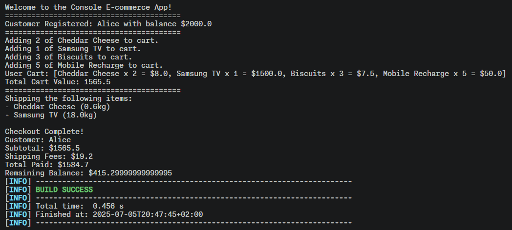
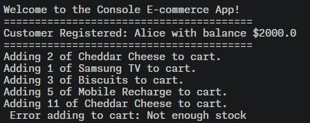
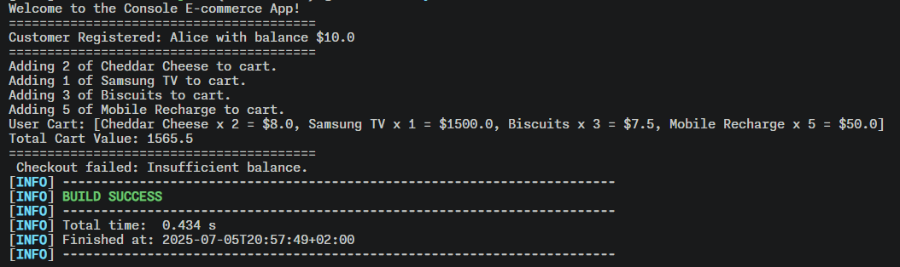
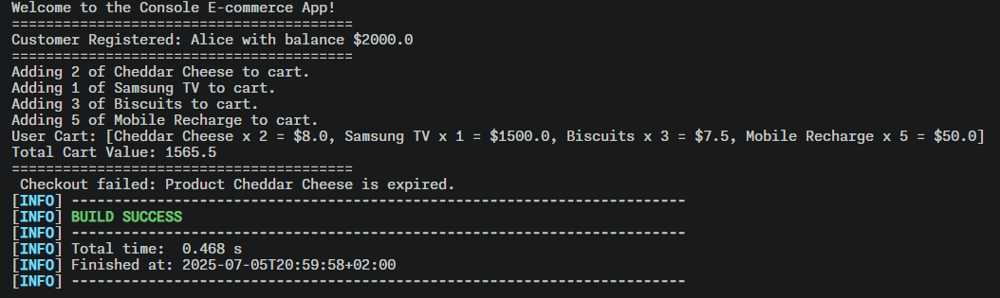

# 🛒 Java E-commerce System

A clean, modular Java console-based e-commerce application built with **Maven**, demonstrating strong **Object-Oriented Design**, **Design Patterns**, and adherence to **SOLID principles**.

---

## 📦 Features

- ✅ Define various types of products:
  - Basic (non-expirable, non-shippable)
  - Expirable (e.g., food)
  - Shippable (e.g., electronics)
  - Expirable + Shippable (e.g., cheese)
- ✅ Add products to cart (with stock validation)
- ✅ Handle product expiration and shipping logic
- ✅ Checkout flow with:
  - Subtotal calculation
  - Shipping fee aggregation
  - Balance validation
  - Error handling
- ✅ Shipping Service integration
- ✅ 🏭 Product and Customer creation via **Factory + Builder pattern**
- ✅ Maven build system

---

## 🏗️ Design Patterns Used

| Pattern               | Usage Description                                                         |
|----------------------|-----------------------------------------------------------------------------|
| **Factory**           | Centralized object creation (`ProductFactory`, `CustomerFactory`)          |
| **Builder**           | Fluent object construction for `Customer` and (optionally) complex products|
| **Strategy**          | Shipping logic defined by interface to allow flexible implementation       |
| **Single Responsibility** | Each class has one well-defined responsibility                        |
| **Open/Closed**       | New product types can be added without modifying existing code             |
| **Liskov Substitution** | Subtypes of `BaseProduct` used anywhere a product is expected            |
| **Interface Segregation** | Small, focused interfaces like `Shippable`, `Expirable`                |
| **Dependency Inversion** | `ShippingService` depends on abstraction, not implementation            |

---

## 📁 Folder Structure

```
ecommerce_system/
├── pom.xml
├── snapshots/
│   ├── successful_checkout.png
│   ├── error_stock.png
│   ├── error_balance.png
│   └── error_expiry.png
└── src/
    └── main/
        └── java/
            ├── Main/
            │   └── ui/
            │       ├── ConsoleApp.java
            │       └── Main.java
            ├── Main/Java/model/
            │   ├── Customer.java
            │   ├── Cart.java
            │   ├── CartItem.java
            │   └── product/
            │       ├── BaseProduct.java
            │       ├── BasicProduct.java
            │       ├── ExpirableProduct.java
            │       ├── ExpirableShippableProduct.java
            │       └── ShippableProduct.java
            ├── Main/Java/service/
            │   ├── ShippingService.java
            │   └── SimpleShippingService.java
            ├── Main/Java/factory/
            │   ├── ProductFactory.java
            │   └── CustomerFactory.java
            └── Main/Java/builder/
                └── CustomerBuilder.java
```

---

## 📸 Sample Output

### ✅ Successful Checkout


### ❌ Stock Exceeded Error


### 💸 Insufficient Balance


### ⌛ Expired Product Error


---

## 🧪 How to Run

```bash
# Compile project
mvn clean compile

# Run the app
mvn exec:java -Dexec.mainClass="Main.ui.Main"
```

---

## 🔧 Maven Overview

```xml
<properties>
  <maven.compiler.source>1.8</maven.compiler.source>
  <maven.compiler.target>1.8</maven.compiler.target>
</properties>

<build>
  <plugins>
    <plugin>
      <groupId>org.codehaus.mojo</groupId>
      <artifactId>exec-maven-plugin</artifactId>
      <version>3.1.0</version>
      <configuration>
        <mainClass>Main.ui.Main</mainClass>
      </configuration>
    </plugin>
  </plugins>
</build>
```

## 👨‍💻 Author

Built by **Abdelrahman Sherif** using Java 8, Maven
